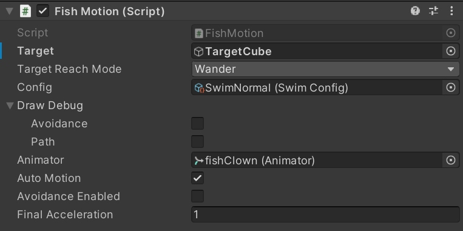
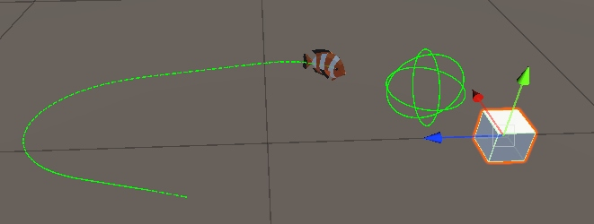
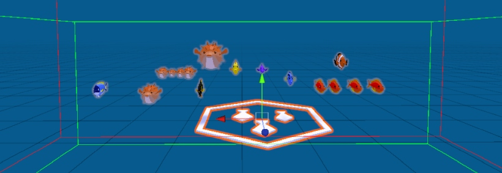
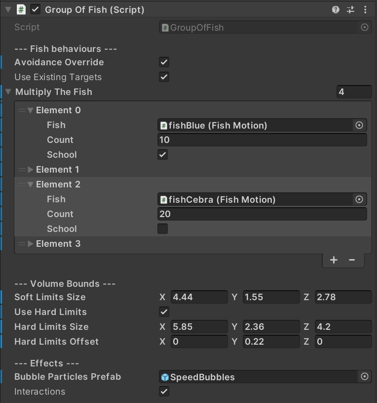

# Fish Alive Guide

This guide covers the shared scripts, setup, and information common to Fish Alive animated fish sets.

## Quick start

1. Drag a fish prefab into your scene from `FishAlive/Prefabs/Fish` 
2. Assign an optional target GameObject in the `FishMotion` component.
3. Press Play and move the target in Scene view. The fish will swim naturally and smooth trying to reach the target. 
4. Animate the target from code or even assign another fish as a target to follow.

## The scripts

### FishMotion component

`FishMotion` controls swimming, turning, animation blending, target tracking, and interactions.

**Target**

The GameObject to follow. The script pings its location at the frequency set in the Swim Config object. You can set this to `none` and the fish will continue from the last known position.

**Target Reach Mode**

- `Wander` means the fish swims around randomized positions near the target.
- `Position` means it reaches the target position and stops.
- `Transform` means it reaches the target position and rotation.
- `PositionToBite` means it reaches a suitable position to bite the target, in order to play the bite animation next.

**Config**

`SwimConfig` is a ScriptableObject preset for swimming behavior. Included presets:

- `SwimAgile` for fast and nimble movement
- `SwimClumsy` for slow and relaxed movement
- `SwimNormal` for balanced movement

**Draw Debug**

Visualizes debug information. `Avoidance` shows a wire sphere sensor that turns red when hitting obstacles. `Path` draws the recent movement trail.

**Animator**

Reference to the Animator component.

**Auto Motion**

Set to false to control motion via your own script. When disabled, `FishMotion` will not ping the target or update acceleration. You can then set `Final Acceleration` and call methods like `StartTurnTowardsDirection(...)`.

**Avoidance Enabled**

Enables soft obstacle avoidance. The fish scans a cone in front of it and chooses a clean direction. It prioritizes smooth motion over strict collision avoidance. So when the collision can't be avoided the fish could pass trough the collider.

**Final Acceleration (Manual motion via scripting)**

Defines the target force for accelerated motion. The actual acceleration interpolates over time for smoother motion. Use this only when `Auto Motion` is disabled. 

Setting `FinalAcceleration` is recommended over directly modifying speed for smooth swimming. At some point the fish will reach a constant speed thanks to liquid drag opposite force.  

### GroupOfFish component

`GroupOfFish` manages multiple fish at once. Add the `GroupOfFish` prefab to your scene and make fish its children. It can create targets, apply shared settings, and spawn large groups of fish.

**Avoidance Override**

If enabled, forces avoidance for all fish in the group.

**Use Existing Targets**

If enabled, respects targets already assigned to child fish.

**Multiply The Fish**

Spawns multiple copies of a specified fish prefab. If `School` is enabled, the group can share a target.

**Soft Limits Size**

Defines the volume where fish are likely to swim. Targets move inside this volume but fish are not constrained.

**Use Hard Limits**

Enables strict bounds that fish will never pass. Hard limits will effectively create collision planes that mimic an aquarium glass.

**Hard Limits Size**

Defines the strict boundary volume.

**Hard Limits Offset**

Offsets the hard limits relative to the group position.

**Bubble Particles Prefab**

Adds bubbles when fish are moving too fast.

**Interactions**

Adds biting interaction. Fish will bite anything tagged `food` and on layer 20.

## Back to...

**[Marine Set overview](marine.md)**

**[Freshwater Set overview](freshwater.md)**
