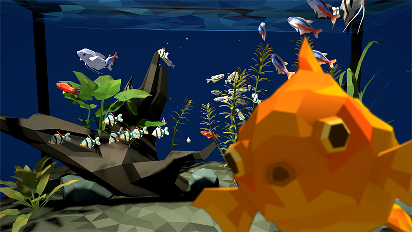
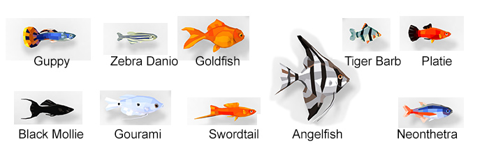
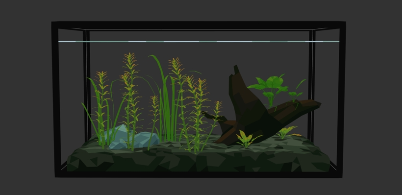
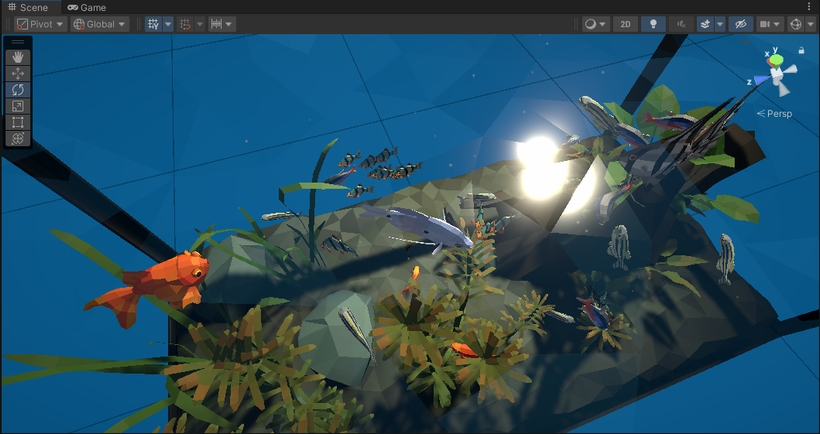
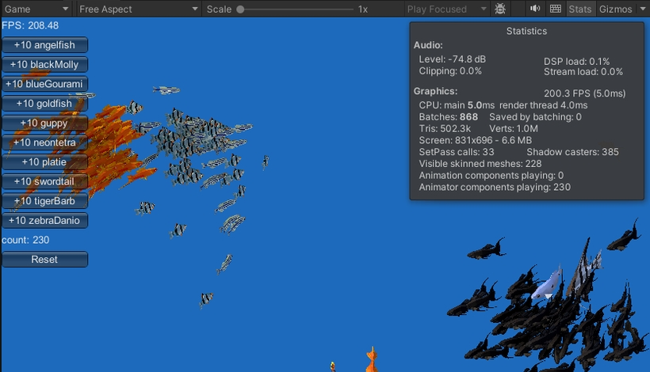
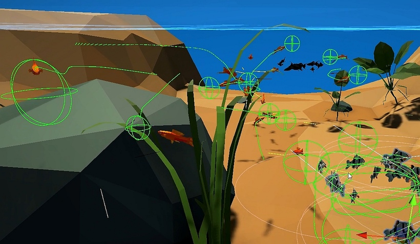

# Fish Alive Freshwater Set Overview

The Freshwater Set represents tropical fish designed to help building ornamental aquariums and natural forest environments.

## What is included?

| Asset | Count |
|-|-|
| Fish skinned meshes | 10 |
| Animations (per fish) | 7 |
| Average triangle count (per fish) | ~500 |
| Aquarium static meshes | 19 |
| Total script (.cs) files | 10 | 
| Textures | 4 |
| Materials | 7 |
| Custom Shaders | 1 |

## Demo scenes

### Demo_Freshwater_Aquarium.unity

A showcase scene featuring freshwater fish in a stylized aquarium environment. Demonstrate the use of `GroupOfFish`, collision avoidance and interactions

[LOAD LIVE-WEB-DEMO (9.7mb)](https://denysalmaral.com/gamedev/fish-alive-aquarium/index.html)

### Demo_Freshwater_Benchmark.unity

Benchmark scene for freshwater fish. Use the buttons to multiply fish and observe performance. The FPS is shown at the top left and fish count appears above the Reset button.

### Demo_Freshwater_AvoidanceRiver.unity

A showcase scene featuring a river segment. With focus on the collision avoidance setup.

## See also...

**[Fish Alive Documentation](fishalive.md)**
