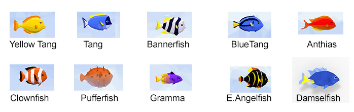
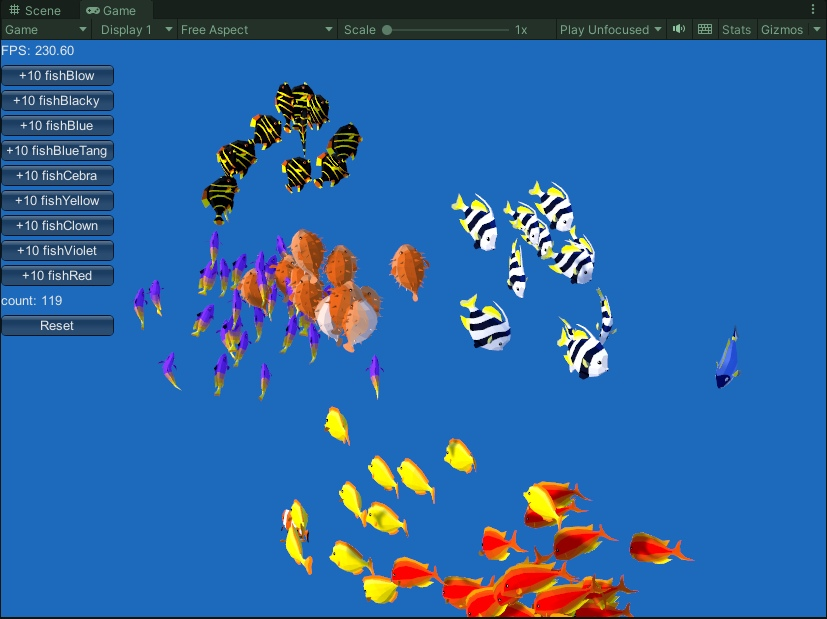

# Fish Alive Marine Set Overview

The Marine Set represents colorful reef fish designed to bring vibrant underwater life ready to dive into your ocean scenes.

## What is included?

| Asset | Count |
|-|-|
| Fish skinned meshes | 10 |
| Animations (per fish) | 7 |
| Average triangle count (per fish) | ~460 |
| Coral Reef static meshes | 21 |
| Total script (.cs) files | 10 | 
| Textures | 4 |
| Materials | 7 |
| Custom Shaders | 1 |

## Demo scenes

### Demo_Marine_Benchmark.unity

Benchmark scene for marine fish. Use the buttons to multiply fish and observe performance. The FPS is shown at the top left and fish count appears above the Reset button.

### Demo_Marine_CoralReef.unity

Full marine showcase with coral reef environment, helpers like `GroupOfFish`, effects, and interactions.

## See also...

**[Fish Alive Documentation](fishalive.md)**
