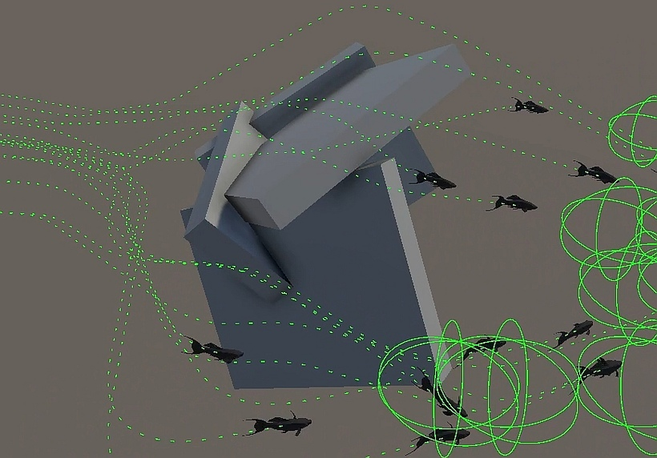

# Obstacle Avoidance Guide

This system **tries** to prevent fish from swimming through solid objects you define using colliders. It is designed as a visual aid to keep movement natural rather than a heavy physics collision resolution.

[WATCH THE VIDEO GUIDE](https://youtu.be/D19_UKl00Sw)

## Prepare for avoidance

To make fish acknowledge obstacles in their path:

- **Add Colliders:** Ensure your obstacle objects (rocks, terrain, etc.) have a Collider attached (e.g., Sphere Collider or Box Collider).

- **Enable Avoidance:** Check `Avoidance Enabled` directly on a fish or on the `GroupOfFish` component, check the Avoidance Override box. This overrides individual settings and forces avoidance logic on every fish in the group.

Hit play and the system should work at this point. In order to ensure the collisions are detected use the debug visuals explained bellow.

## Handle Boundaries (optional step)

If you need to restrict fish swimming underground or flying above the water surface, first try enabling Hard Limits in the `GroupOfFish` settings. This defines the hard volume they cannot leave. Soft Limits will also help to keep the group swimming inside a suggested area.

## How It Works

When avoidance is active, fish cast a detection sphere forward to its motion. If colliders are ahead it tries to find a way out with the most gentle turn to steer away from the obstacle, rather than stopping or sliding abruptly.

**Debug Visuals:** For each fish check `Avoidance` and `Path` on the `Draw Debug` section of the `FishMotion` component. A sphere appears in front of the fish; if it turns red, a collision has been detected. Also you will see a path left behind as a green curve.

## Performance & Best Practices

Visuals vs. Physics: This feature is a balanced trade-off intended for better visuals, not a perfect collision system.

If you have a small patch of fish swimming in the middle of a large body of water (far from walls or the bottom), you don't need avoidance or boundary checks. 

## See also...

[FishMotion component reference](fishalive.md#fishmotion-ref)

[GroupOfFish Guide](GroupOfFish-guide.md)